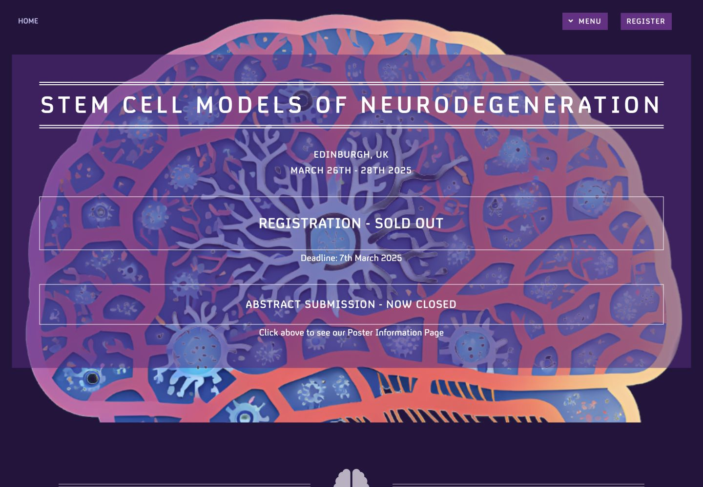
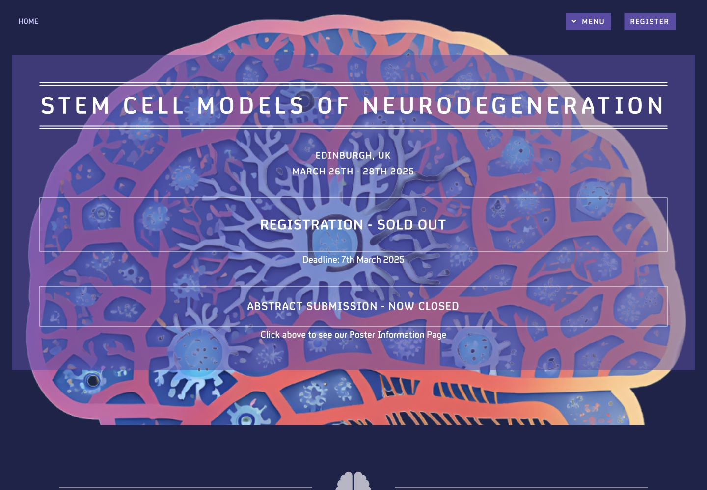
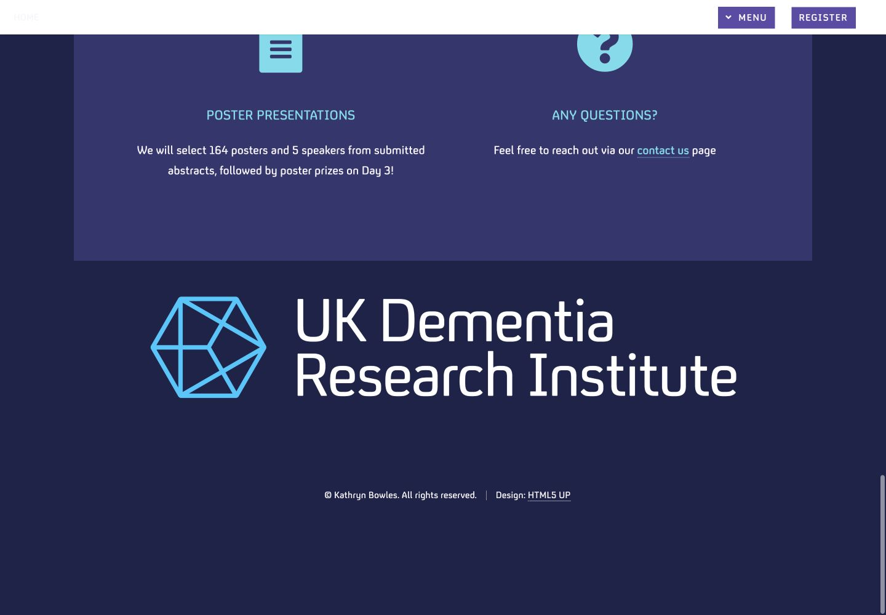
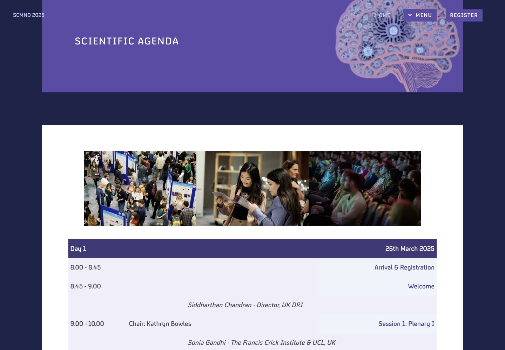
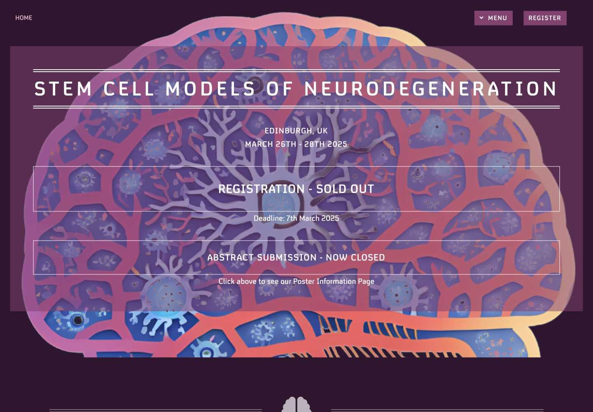
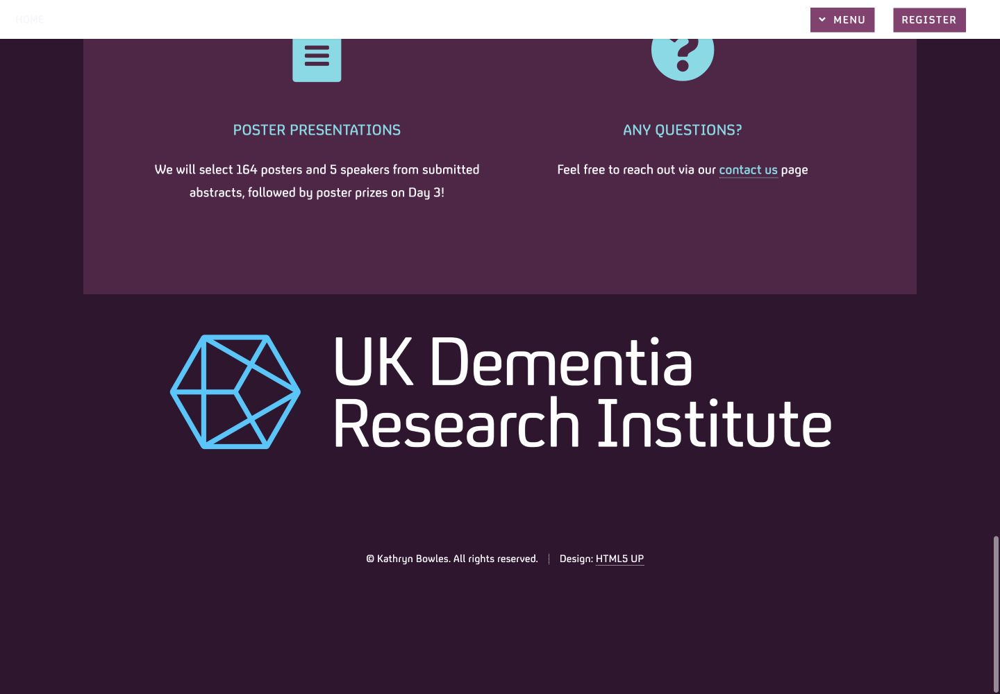
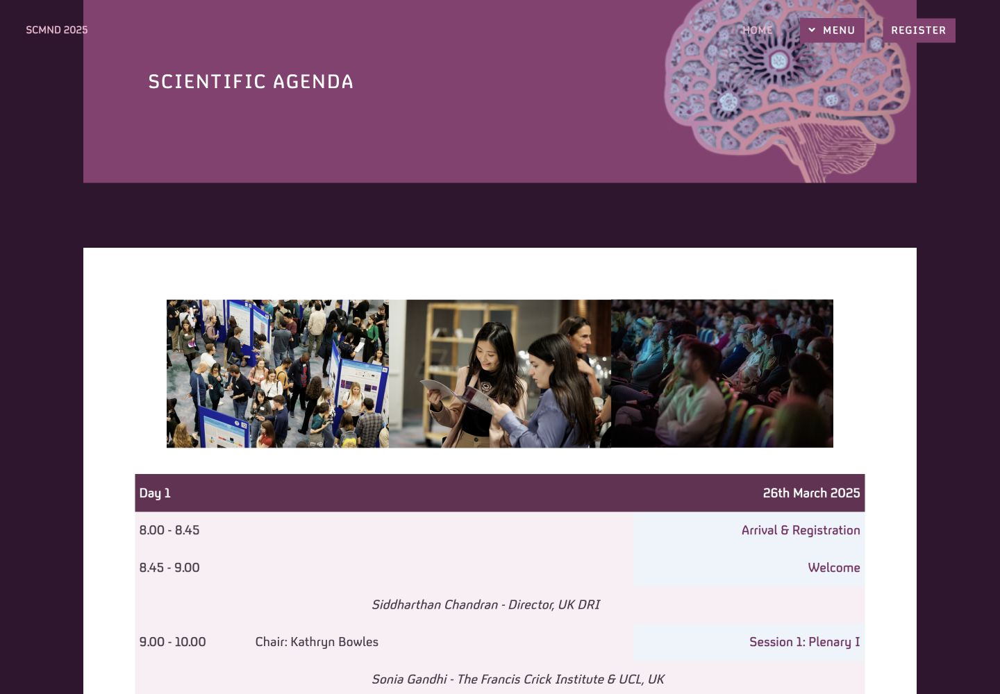
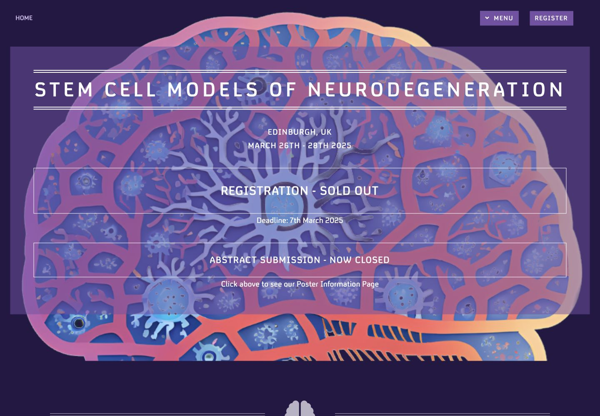
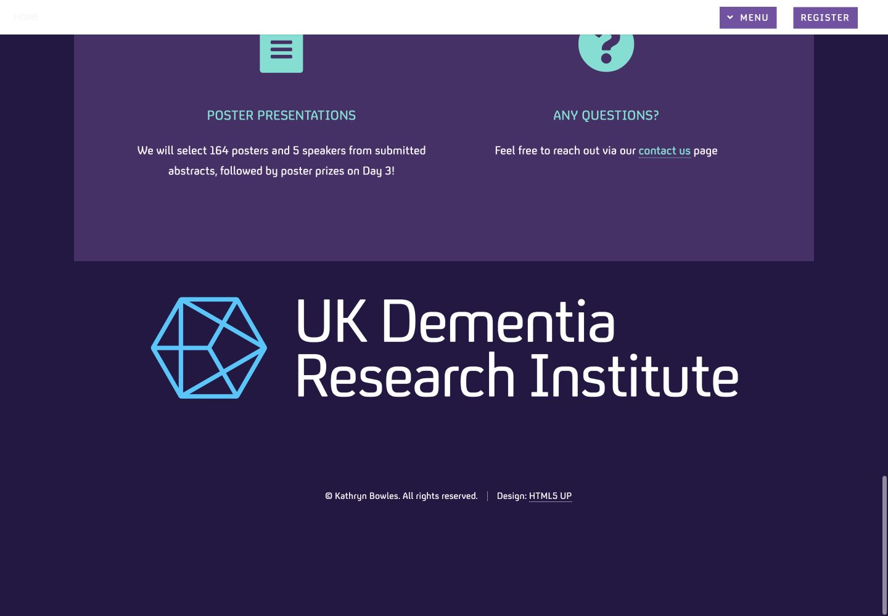
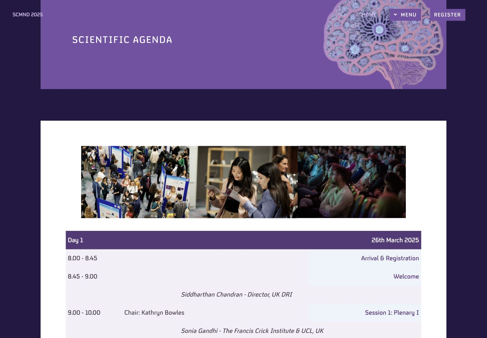

# Color scheme options

Each option is shown at a matched 1440 × 1000 viewport using only the homepage,
homepage footer, and Agenda. The approved deep-purple scheme is included as the
control.

## Current: Deep Purple

Balanced aubergine with cyan, coral, and lavender accents.

`#24133d` background · `#5a2a83` feature · `#482365` panel · `#58d9e8` accent

| Homepage | Homepage footer | Agenda |
| --- | --- | --- |
|  |  |  |

## Option A: Indigo Orchid

Cooler and more institutional, with a stronger blue-violet foundation.

`#1e234a` background · `#5d4ba8` feature · `#34366f` panel · `#67dceb` accent

| Homepage | Homepage footer | Agenda |
| --- | --- | --- |
|  |  |  |

## Option B: Mulberry Rose

Warmer and more expressive, drawing more strongly from the coral and pink in
the brain artwork.

`#32152f` background · `#8a3d72` feature · `#542447` panel · `#6ddbe7` accent

| Homepage | Homepage footer | Agenda |
| --- | --- | --- |
|  |  |  |

## Option C: Amethyst Teal

Brighter and more contemporary, with clearer teal and apricot accents.

`#251744` background · `#7550a6` feature · `#49306a` panel · `#65e0d2` accent

| Homepage | Homepage footer | Agenda |
| --- | --- | --- |
|  |  |  |

## Accessibility

All three options retain at least WCAG AA contrast for the principal body,
link, button, panel, and table text combinations.
